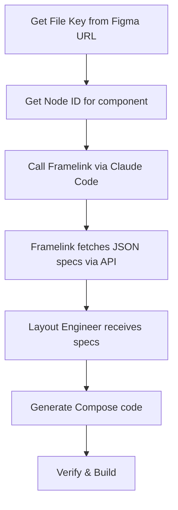
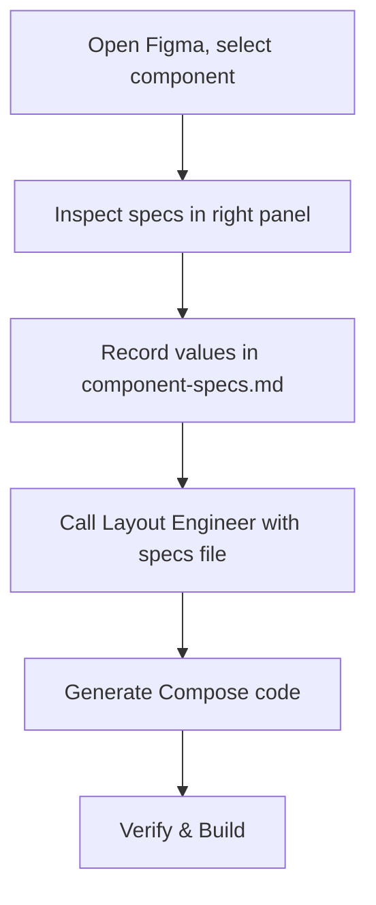
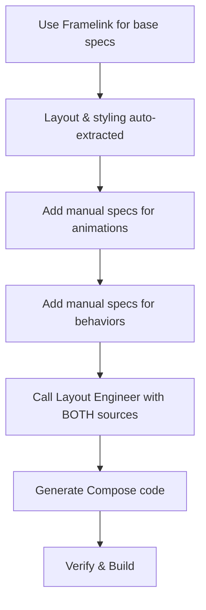

# 🔄 Figma to Compose - Workflow Porównanie

**Purpose**: Porównanie dwóch metod konwersji design → code
**When to use**: Gdy decydujesz jak konwertować nowy component z Figmy
**Last Update**: 2025-10-03

---

## 🎯 QUICK DECISION GUIDE

Wybierz metodę na podstawie sytuacji:

| **Sytuacja** | **Zalecana Metoda** | **Uzasadnienie** |
|------------|------------------|----------------|
| Masz File Key z Figmy | **Framelink (Auto)** | Szybsze, bardziej accurate |
| Nie masz dostępu do Figmy | **Manual** | Jedyna opcja |
| Simple component (1-2 elementy) | **Manual** | Szybciej przepisać ręcznie |
| Complex component (5+ elementów) | **Framelink (Auto)** | Za dużo danych do przepisania |
| Component z animations | **Hybrid** | Framelink + manual specs dla animacji |
| Potrzebujesz offline work | **Manual** | Nie potrzebujesz API connection |
| Design często się zmienia | **Framelink (Auto)** | Łatwo re-fetch updated specs |

---

## 📋 METHOD 1: FRAMELINK (AUTO)

### 🚀 Workflow



### 🔧 Commands

#### **Step 1: Get File Key & Node ID**

```bash
# Otwórz Figma w przeglądarce, skopiuj URL:
# https://www.figma.com/design/ABC123XYZ/TV-Components?node-id=789:012
#                               ^^^^^^^^^ File Key
#                                                         ^^^^^^^ Node ID
```

#### **Step 2: Extract Specs**

```bash
claude code \
  --tool figma \
  --figma-file "ABC123XYZ" \
  --figma-node "789:012" \
  -p "Extract complete specs for this component:
      - Dimensions, position, styling
      - Colors (hex codes)
      - Typography if text present
      - Border radius, padding
      - Focus states (if multiple variants)"
```

**Output Example:**
```json
{
  "name": "CategoryIcon",
  "width": 216,
  "height": 216,
  "fills": [{"color": "#2C2C2C"}],
  "cornerRadius": 12,
  "strokes": [{"color": "#5AECD3", "weight": 4}]
}
```

#### **Step 3: Convert to Compose**

```bash
claude code \
  -f docs/agents/layout-engineer.md \
  -f docs/figma/design-system.md \
  --tool figma \
  --figma-file "ABC123XYZ" \
  --figma-node "789:012" \
  -p "Layout Engineer: Convert this component to Compose.
      Use sx/sy scaling, follow design system.
      Add focus states (4px aqua border).
      Include FocusRequester and focusable() setup."
```

**Output Example:**
```kotlin
/**
 * CategoryIcon - Converted from Figma
 * Node ID: 789:012
 * Figma specs: 216x216px, radius 12px, border 4px #5AECD3 when focused
 */
@Composable
fun CategoryIcon(
    isFocused: Boolean,
    sx: (Int) -> Dp,
    sy: (Int) -> Dp
) {
    Box(
        modifier = Modifier
            .size(sx(216), sy(216))
            .clip(RoundedCornerShape(sx(12)))
            .background(Color(0xFF2C2C2C))
            .border(
                width = if (isFocused) sx(4) else 0.dp,
                color = if (isFocused) Color(0xFF5AECD3) else Color.Transparent
            )
    )
}
```

#### **Step 4: Verify & Test**

```bash
# Skopiuj kod do pliku
# Build & test na urządzeniu

./gradlew assembleDebug
~/Library/Android/sdk/platform-tools/adb -s 192.168.31.229:5555 install -r app/build/outputs/apk/debug/app-debug.apk
```

### ✅ Pros

- **Szybkość**: Instant extraction (5-10 sekund)
- **Accuracy**: 100% dokładność (direct API data)
- **Consistency**: Nie ma "typo" errors
- **Up-to-date**: Zawsze najnowsza wersja z Figmy
- **Comprehensive**: Wyciąga wszystkie dostępne properties
- **Re-usable**: Łatwo re-fetch gdy design się zmienia

### ❌ Cons

- **Wymaga File Key**: Musisz mieć dostęp do Figma project
- **API Rate Limit**: Max ~100 requests/minute
- **Nie wyciąga wszystkiego**: Animations, complex gradients manual
- **Token cost**: Wymaga Figma Access Token dla private files
- **Network dependency**: Potrzebujesz internet connection
- **Learning curve**: Trzeba znać jak używać Framelink MCP

### 📦 What You Get

**Z Framelink API:**
- ✅ Width, Height, X, Y position
- ✅ Background color (#HEX)
- ✅ Border (width, color)
- ✅ Corner radius
- ✅ Shadow/Elevation
- ✅ Opacity
- ✅ Typography (size, weight, line height, letter spacing, color)
- ✅ Image fills (URLs)
- ✅ AutoLayout (flex direction, alignment, spacing)

**Czego NIE dostaniesz:**
- ❌ Animations (manual specs)
- ❌ Interactive prototype flows
- ❌ Component instance logic
- ❌ Complex gradients (może być nieprecyzyjnie)

---

## 📝 METHOD 2: MANUAL EXPORT

### 🚀 Workflow



### 🔧 Commands

#### **Step 1: Inspect in Figma**

```
1. Otwórz Figma
2. Kliknij na component (np. CategoryIcon)
3. Sprawdź right panel:
   - Design tab → Width, Height, Position
   - Fill → Background color
   - Stroke → Border width, color
   - Effects → Corner radius, shadow
4. Zapisz wartości
```

#### **Step 2: Record Specs**

Skopiuj template z `component-specs.md` i wypełnij:

```markdown
## CategoryIcon

**Figma Frame**: CategoryIcon
**Source Code**: N/A (new component)

### Dimensions
- Width: 216px
- Height: 216px
- Aspect Ratio: 1:1

### Styling
- Background: #2C2C2C
- Border radius: 12px
- Border (default): 0px
- Border (focused): 4px solid #5AECD3

### States
- Default: No border, normal appearance
- Focused: 4px aqua border
```

Zapisz w `docs/figma/component-specs.md`.

#### **Step 3: Convert to Compose**

```bash
claude code \
  -f docs/agents/layout-engineer.md \
  -f docs/figma/design-system.md \
  -f docs/figma/component-specs.md \
  -p "Layout Engineer: Build CategoryIcon from specs in component-specs.md.
      Use sx/sy scaling, follow design system.
      Add focus states as specified."
```

**Output**: Ten sam Compose code jak w metodzie Framelink.

#### **Step 4: Verify & Test**

```bash
# Build & test
./gradlew assembleDebug
adb install -r app/build/outputs/apk/debug/app-debug.apk
```

### ✅ Pros

- **No API needed**: Działa offline, bez File Key
- **Simple**: Nie trzeba znać Framelink
- **Flexible**: Możesz dodać custom notes (np. animations)
- **Complete control**: Decydujesz co zapisać
- **Works everywhere**: Nie wymaga Figma access (screenshot wystarczy)
- **Zero rate limits**: Nie zależy od API quota

### ❌ Cons

- **Slow**: 5-10 minut na component (manual copying)
- **Error-prone**: "Typo" errors, missed values
- **Out-of-sync**: Manual update gdy design się zmienia
- **Incomplete**: Łatwo pominąć properties
- **Tedious**: Męczące dla complex components (10+ elements)
- **No validation**: Nie ma auto-check czy wartości są poprawne

### 📦 What You Get

**Zależy od Ciebie:**
- ✅ Wszystko co zapiszesz w specs
- ❌ Wszystko co pominiesz

**Typically record:**
- Width, Height, Position
- Background color
- Border (width, color, radius)
- Typography (size, weight, color)
- States (default, focused, disabled)
- Custom notes (animations, behaviors)

---

## 🔀 METHOD 3: HYBRID (RECOMMENDED)

### 🚀 Workflow



### 🔧 Commands

#### **Step 1: Auto-extract Base Specs**

```bash
# Framelink dla layout, styling, typography
claude code \
  --tool figma \
  --figma-file "ABC123XYZ" \
  --figma-node "789:012" \
  -p "Extract base specs: dimensions, colors, borders, typography"
```

#### **Step 2: Manual Specs dla Animations**

Dodaj do `component-specs.md`:

```markdown
## CategoryIcon

[... base specs from Framelink ...]

### Animations (Manual)
- **Focus transition**: Instant (no animation on border)
- **Icon animation**: Lottie animation when focused (if available)
- **Duration**: N/A for border (instant)

### Behaviors (Manual)
- **Always positioned**: X=80px in all sections
- **Y position**: Animates smoothly (500ms) when focus changes between rows
- **First focusable**: col=-1 in each row
```

#### **Step 3: Convert with Both Sources**

```bash
claude code \
  -f docs/agents/layout-engineer.md \
  -f docs/figma/design-system.md \
  -f docs/figma/component-specs.md \
  --tool figma \
  --figma-file "ABC123XYZ" \
  --figma-node "789:012" \
  -p "Layout Engineer: Build component using:
      - Framelink specs for base layout/styling
      - Manual specs in component-specs.md for animations/behaviors"
```

**Output**: Complete Compose code with animations & behaviors.

### ✅ Pros

- **Best of Both**: Speed of Framelink + flexibility of manual
- **Complete**: Base specs auto + custom specs manual
- **Accurate**: API dla layout, human dla logic
- **Maintainable**: Re-fetch base specs, preserve manual additions
- **Flexible**: Dodawaj manual specs tylko gdy potrzebne

### ❌ Cons

- **Two-step process**: Wymaga Framelink + manual work
- **Coordination**: Musisz wiedzieć co gdzie zapisać
- **Duplication risk**: Uważaj żeby nie duplikować specs w obu źródłach

---

## 📊 COMPARISON TABLE

| **Aspekt** | **Framelink (Auto)** | **Manual** | **Hybrid** |
|-----------|-------------------|----------|----------|
| **Speed** | ⚡⚡⚡ Fast (5-10s) | 🐢 Slow (5-10min) | ⚡⚡ Medium (2-3min) |
| **Accuracy** | ✅ 100% | ⚠️ Error-prone | ✅ 95% |
| **Completeness** | ⚠️ Missing animations | ⚠️ Missing data risk | ✅ Complete |
| **Offline** | ❌ Needs internet | ✅ Works offline | ❌ Needs internet |
| **Rate Limits** | ⚠️ 100 req/min | ✅ Unlimited | ⚠️ 100 req/min |
| **Learning Curve** | 📈 Medium (Framelink) | 📉 Easy | 📈 Medium |
| **Maintenance** | ✅ Re-fetch easy | ⚠️ Manual update | ✅ Re-fetch + preserve |
| **Custom Notes** | ❌ No | ✅ Yes | ✅ Yes |

---

## 🎯 DECISION MATRIX

### Użyj **Framelink (Auto)** gdy:

- ✅ Masz File Key z Figmy
- ✅ Component jest complex (5+ elements)
- ✅ Design często się zmienia
- ✅ Chcesz 100% accuracy dla layout
- ✅ Nie potrzebujesz custom animation specs

### Użyj **Manual** gdy:

- ✅ Nie masz dostępu do Figmy
- ✅ Component jest simple (1-2 elements)
- ✅ Potrzebujesz offline work
- ✅ Chcesz dodać custom notes (animations, behaviors)
- ✅ Screenshot wystarczy (np. od klienta)

### Użyj **Hybrid** gdy:

- ✅ Component ma animations (Framelink nie wyciąga)
- ✅ Component ma complex behaviors
- ✅ Chcesz best of both worlds
- ✅ Design jest stabilny (base specs) + custom logic (manual)
- ✅ Masz czas na two-step process

---

## 🛠 TOOLS & FILES

### Framelink (Auto)

**Tools:**
- `mcp__figma-dev-mode__get_figma_data` - fetch specs
- `mcp__figma-dev-mode__download_figma_images` - download images

**Required Files:**
- `docs/agents/layout-engineer.md` - agent definition
- `docs/figma/design-system.md` - design values
- `docs/figma/framelink-guide.md` - instructions

**Optional:**
- `docs/figma/component-specs.md` - backup/uzupełnienie

### Manual

**Tools:**
- Figma UI (inspect panel)
- Text editor (nano, vim, VSCode)

**Required Files:**
- `docs/figma/component-specs.md` - template + specs
- `docs/agents/layout-engineer.md` - agent definition
- `docs/figma/design-system.md` - design values

**Optional:**
- `docs/figma/framelink-guide.md` - reference (if you want to switch later)

### Hybrid

**Tools:**
- Framelink MCP (for base specs)
- Text editor (for manual specs)

**Required Files:**
- All of the above (Framelink + Manual)

---

## 📚 EXAMPLE WORKFLOWS

### Example 1: Simple Component (Manual)

**Component**: Badge (80x24px, text only)

```bash
# 1. Inspect in Figma (30 seconds)
# Width: 80px, Height: 24px, Background: #5AECD3, Text: 12px SemiBold #48227C

# 2. Record in component-specs.md (1 minute)
nano docs/figma/component-specs.md
# [paste template, fill values]

# 3. Convert to Compose (30 seconds)
claude code \
  -f docs/agents/layout-engineer.md \
  -f docs/figma/component-specs.md \
  -p "Build Badge from specs"

# Total time: ~2 minutes
```

### Example 2: Complex Component (Framelink)

**Component**: SliderMaxCard (1326x742px, video player + overlay + controls)

```bash
# 1. Get File Key & Node ID (30 seconds)
# File Key: ABC123XYZ, Node ID: 500:600

# 2. Extract specs (10 seconds)
claude code \
  --tool figma \
  --figma-file "ABC123XYZ" \
  --figma-node "500:600" \
  -p "Extract complete specs"

# 3. Convert to Compose (30 seconds)
claude code \
  -f docs/agents/layout-engineer.md \
  --tool figma \
  --figma-file "ABC123XYZ" \
  --figma-node "500:600" \
  -p "Layout Engineer: Convert to Compose"

# Total time: ~1 minute
```

### Example 3: Component with Animations (Hybrid)

**Component**: CategoryIcon (216x216px, Lottie animation on focus)

```bash
# 1. Get base specs via Framelink (10 seconds)
claude code \
  --tool figma \
  --figma-file "ABC123XYZ" \
  --figma-node "789:012" \
  -p "Extract base specs"

# 2. Add animation specs manually (1 minute)
nano docs/figma/component-specs.md
# [add: "Icon animation: Lottie when focused (500ms)"]

# 3. Convert with both sources (30 seconds)
claude code \
  -f docs/agents/layout-engineer.md \
  -f docs/figma/component-specs.md \
  --tool figma \
  --figma-file "ABC123XYZ" \
  --figma-node "789:012" \
  -p "Build with Framelink specs + manual animation specs"

# Total time: ~2 minutes
```

---

## 🔍 TROUBLESHOOTING

### Problem: Framelink specs incomplete

**Symptom**: Framelink returns basic layout but missing colors/borders
**Cause**: Component uses complex Figma features (variants, instances)
**Solution**: Use Hybrid approach - Framelink for layout, manual for styling

### Problem: Manual specs out-of-sync

**Symptom**: Code doesn't match latest Figma design
**Cause**: Designer updated Figma, specs not updated
**Solution**:
1. Short-term: Update manual specs
2. Long-term: Switch to Framelink (auto re-fetch)

### Problem: Hybrid specs conflict

**Symptom**: Framelink says width=200px, manual says width=216px
**Cause**: Duplicate specs in both sources
**Solution**: Delete duplicate from manual specs, keep only Framelink-exclusive data (animations, behaviors)

---

## 💡 BEST PRACTICES

### 1. Start with Framelink (if available)

```bash
# Always try Framelink first - it's faster
claude code --tool figma ... -p "Extract specs"

# If missing data → add manual specs
# If complete → use as-is
```

### 2. Cache Framelink Results

```bash
# Save Framelink output to file (backup)
claude code --tool figma ... > /tmp/figma-specs.txt

# Add to component-specs.md for offline reference
cat /tmp/figma-specs.txt >> docs/figma/component-specs.md
```

### 3. Manual Specs dla Custom Logic Only

```markdown
## ComponentName

[... Framelink specs auto-extracted ...]

### Animations (Manual - NOT in Figma API)
- Focus transition: 350ms EaseInOutCubic
- Slide down: 290px offset when focused

### Behaviors (Manual - NOT in Figma API)
- Always positioned: X=80px in all sections
- First focusable: col=-1 in each row
```

**Zasada**: Framelink dla layout/styling, Manual dla logic/behaviors.

### 4. Use Design System dla Shared Values

```bash
# Zamiast duplikować kolory w każdym component spec:
# ❌ CategoryIcon: Background #2C2C2C
# ❌ MiniatureCard: Background #2C2C2C
# ❌ TvChannelIconCard: Background #2C2C2C

# ✅ W design-system.md:
val colorSurfaceDark = Color(0xFF2C2C2C)

# W component specs:
# Background: colorSurfaceDark (from design-system.md)
```

### 5. Document Method Used

```markdown
## ComponentName

**Figma Frame**: CategoryIcon
**Method**: Framelink (Auto) + Manual animations
**Last Synced**: 2025-10-03
**File Key**: ABC123XYZ
**Node ID**: 789:012

[... specs ...]
```

**Benefit**: Wiesz jak update specs później.

---

## 🔗 RELATED FILES

- **Framelink Guide**: `docs/figma/framelink-guide.md` - detailed Framelink instructions
- **Component Specs**: `docs/figma/component-specs.md` - template + examples
- **Design System**: `docs/figma/design-system.md` - shared design values
- **Layout Engineer**: `docs/agents/layout-engineer.md` - conversion agent definition

---

## 🎓 LEARNING PATH

### Beginner: Start with Manual

1. ✅ Read `component-specs.md` template
2. ✅ Inspect 1-2 simple components in Figma
3. ✅ Record specs manually
4. ✅ Call Layout Engineer
5. ✅ Build & test

**Goal**: Understand what data you need.

### Intermediate: Try Framelink

1. ✅ Read `framelink-guide.md`
2. ✅ Get File Key from Figma
3. ✅ Extract specs for simple component
4. ✅ Compare with manual method
5. ✅ Build & test

**Goal**: See Framelink speed & accuracy.

### Advanced: Use Hybrid

1. ✅ Extract base specs via Framelink
2. ✅ Add custom animations/behaviors manually
3. ✅ Call Layout Engineer with both sources
4. ✅ Build & test

**Goal**: Best of both worlds.

---

## 📊 TIME ESTIMATES

| **Task** | **Framelink** | **Manual** | **Hybrid** |
|---------|------------|---------|---------|
| Get File Key/Node ID | 30s | N/A | 30s |
| Extract base specs | 10s | 5-10min | 10s |
| Add custom specs | N/A | (included) | 1-2min |
| Convert to Compose | 30s | 30s | 30s |
| **Total** | **~1min** | **~5-10min** | **~2-3min** |

**Note**: Times for single component. Complex components (10+ elements) - Manual może zająć 15-20 minut.

---

## 🎯 QUICK REFERENCE

### Framelink Command
```bash
claude code \
  -f docs/agents/layout-engineer.md \
  --tool figma \
  --figma-file "FILE_KEY" \
  --figma-node "NODE_ID" \
  -p "Layout Engineer: Convert to Compose with sx/sy"
```

### Manual Command
```bash
claude code \
  -f docs/agents/layout-engineer.md \
  -f docs/figma/component-specs.md \
  -p "Layout Engineer: Build [ComponentName] from specs in component-specs.md"
```

### Hybrid Command
```bash
claude code \
  -f docs/agents/layout-engineer.md \
  -f docs/figma/component-specs.md \
  --tool figma \
  --figma-file "FILE_KEY" \
  --figma-node "NODE_ID" \
  -p "Layout Engineer: Use Framelink for base + manual specs for animations"
```

---

**END OF WORKFLOW COMPARISON**

Last updated: 2025-10-03

**Next**: Wybierz metodę dla swojego pierwszego component i testuj!
